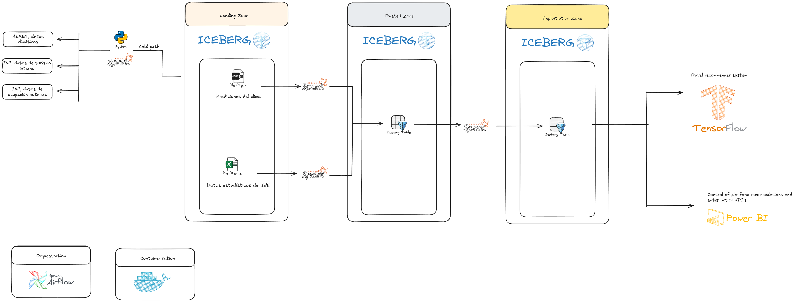

# TravelMind

## Docker Installation & Setup

### Prerequisites

Make sure you have [Docker](https://www.docker.com/) and [Docker Compose](https://docs.docker.com/compose/) installed on your system.

### Quick Start

1. **Clone the repository:**
   ```bash
   git clone <repository-url>
   cd TravelMind
   ```

2. **Build and start the Docker containers:**
   ```bash
   cd architecture
   docker-compose build --no-cache
   docker-compose up -d
   ```

3. **Access the services:**
   - **Spark Master UI**: [http://localhost:8080](http://localhost:8080)
   - **Airflow UI**: [http://localhost:8090](http://localhost:8090) (username: `airflow`, password: `airflow`)
   - **MinIO Console**: [http://localhost:9001](http://localhost:9001) (username: `minioadmin`, password: `minioadmin`)
   - **PgAdmin**: [http://localhost:8050](http://localhost:8050) (username: `root@root.com`, password: `root`)

### Common Docker Commands

#### Starting and Stopping Services
```bash
# Start all services
cd architecture
docker-compose up -d

# Stop all services
docker-compose down

# Stop and remove all containers, networks, and volumes
docker-compose down -v

# Restart all services
docker-compose restart

# Restart a specific service
docker-compose restart spark-master
```

#### Building and Rebuilding
```bash
# Build all images from scratch (no cache)
docker-compose build --no-cache

# Build a specific service
docker-compose build spark-master

# Build and start in one command
docker-compose up --build -d
```

#### Monitoring and Debugging
```bash
# View logs for all services
docker-compose logs

# View logs for a specific service
docker-compose logs spark-master
docker-compose logs airflow-webserver

# Follow logs in real-time
docker-compose logs -f spark-master

# Check status of all services
docker-compose ps

# Execute commands inside a container
docker-compose exec spark-master bash
docker-compose exec airflow-webserver bash
```

#### Airflow Management
```bash
# Initialize Airflow database (first time only)
docker-compose exec airflow-webserver airflow db init

# Create admin user (first time only)
docker-compose exec airflow-webserver airflow users create \
    --username airflow \
    --password airflow \
    --firstname Airflow \
    --lastname Admin \
    --role Admin \
    --email admin@example.com

# List DAGs
docker-compose exec airflow-webserver airflow dags list

# Trigger a DAG manually
docker-compose exec airflow-webserver airflow dags trigger example_spark_dag
```

#### Spark Jobs
```bash
# Submit a Spark job directly
docker-compose exec spark-master spark-submit \
    --master spark://spark-master:7077 \
    /app/your_spark_script.py

# Run Python script with Spark
docker-compose exec spark-master python /app/test_spark_minio_simple.py
```

#### Data Management
```bash
# Access MinIO CLI
docker-compose exec mc bash

# List MinIO buckets
docker-compose exec mc mc ls minio

# Copy files to MinIO
docker-compose exec mc mc cp /sample.csv minio/bucket1/
```

#### Cleanup Commands
```bash
# Remove all stopped containers
docker container prune

# Remove all unused images
docker image prune

# Remove all unused volumes
docker volume prune

# Complete cleanup (use with caution)
docker system prune -a
```

### Troubleshooting

#### Common Issues

1. **Port conflicts**: If ports are already in use, modify the port mappings in `docker-compose.yml`
2. **Permission issues**: Ensure Docker has proper permissions on your system
3. **Memory issues**: Increase Docker memory allocation in Docker Desktop settings

#### Reset Everything
```bash
# Stop and remove everything
docker-compose down -v
docker system prune -a

# Rebuild from scratch
docker-compose build --no-cache
docker-compose up -d
```

### Services Included

- **Apache Spark**: Distributed data processing cluster (Master + Worker + History Server)
- **Apache Airflow**: Workflow orchestration platform
- **MinIO**: S3-compatible object storage for data lake
- **PostgreSQL**: Database backend for Airflow and data storage
- **PgAdmin**: Web-based PostgreSQL administration tool
- **Redis**: Message broker for Airflow Celery executor

TravelMind is a data engineering project focused on ingesting, processing, and exploiting tourism and climate data using PySpark and Apache Iceberg. The repository is organized into three main layers: `landing`, `trusted`, and `exploitation`, each with its own set of Jupyter notebooks and utility scripts.

## Architecture

   
   
## Repository Structure

## Data Pipeline Overview

### 1. Landing Layer

- **Purpose:** Ingests raw data from external APIs (e.g., AEMET for climate, SEGITTUR for hotels and tourism).
- **Key Notebooks:**
  - `aemet_l.ipynb`: Downloads and stores raw climate data.
  - `hoteles.ipynb`: Ingests hotel occupancy data.
  - `turismoProvincia.ipynb`: Ingests inter-provincial tourism data.
- **Utilities:**  
  - [`landing/utils.py`](landing/utils.py): Functions for Spark session creation, API data extraction, and Iceberg table operations.

### 2. Trusted Layer

- **Purpose:** Cleans, normalizes, and validates data from the landing layer, preparing it for analytics.
- **Key Notebooks:**
  - `clima_t.ipynb`: Cleans and imputes missing values in climate data.
  - `f_ocupacion_hotelera.ipynb`: Processes hotel occupancy data (normalization, type casting, filtering).
  - `turismoProvincia.ipynb`: Cleans and uppercases tourism data.
- **Utilities:**  
  - [`trusted/utils.py`](trusted/utils.py): Similar to landing utilities, adapted for trusted data operations.

### 3. Exploitation Layer

- **Purpose:** Prepares trusted data for reporting, dashboards, and advanced analytics.
- **Key Notebooks:**
  - `clima_ez.ipynb`: Selects and filters climate data for reporting.
  - `f_ocupacion_barcelona.ipynb`: Extracts and processes hotel occupancy data for Barcelona.
  - `turismoProvincia.ipynb`: Filters and exports tourism data for specific provinces.
- **Utilities:**  
  - [`exploitation/utils.py`](exploitation/utils.py): Utility functions for exploitation layer.

## Technologies Used

- **PySpark**: Distributed data processing.
- **Apache Iceberg**: Table format for large analytic datasets.
- **Jupyter Notebooks**: Interactive data engineering and analysis.
- **Pandas**: Auxiliary data manipulation.
- **Requests**: API data ingestion.

## How to Run

### 1. Levantar la arquitectura Dockerizada

Asegúrate de tener [Docker](https://www.docker.com/) y [Docker Compose](https://docs.docker.com/compose/) instalados.

```sh
docker-compose up -d
```

Esto levantará los siguientes servicios:
- **MinIO** (almacenamiento S3 para tablas Iceberg)
  - UI: [http://localhost:9001](http://localhost:9001) (usuario: `minio`, password: `minio123`)
- **Spark Master** (cluster de procesamiento)
  - UI: [http://localhost:8080](http://localhost:8080)
- **Airflow** (orquestación de pipelines)
  - UI: [http://localhost:8081](http://localhost:8081) (usuario: `airflow`, password: `airflow` por defecto)
- **Postgres** (backend de Airflow)

### 2. Inicializar Airflow

La primera vez, inicializa la base de datos y crea el usuario admin:

```sh
docker-compose exec airflow-webserver airflow db init
docker-compose exec airflow-webserver airflow users create \
    --username airflow \
    --password airflow \
    --firstname Airflow \
    --lastname Admin \
    --role Admin \
    --email admin@example.com
```

### 3. Lanzar un pipeline de ejemplo

Hay un DAG de ejemplo en `dags/example_spark_dag.py` que lanza un job de Spark Pi al cluster Spark. Puedes activarlo desde la UI de Airflow.

### 4. Parar los servicios

```sh
docker-compose down
```

### 5. (Opcional) Instalar dependencias Python locales
Si quieres ejecutar notebooks o scripts locales:
```sh
pipenv install
```

